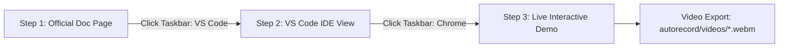
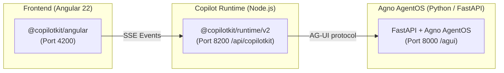

# CopilotKit + Agno (Python) Autorecording Suite — Angular 🎬

Automated, high-fidelity Playwright screen-demo/video engine for the **CopilotKit Angular 22 + Agno AgentOS (Python)** integration test harness.

## Contents

- [Overview](#overview)
- [3-Step Video Workflow](#3-step-video-workflow)
- [Architecture & 3-Tier Model](#architecture--3-tier-model)
- [Directory Structure](#directory-structure)
- [Specialized Action Handlers & Overlays](#specialized-action-handlers--overlays)
- [Prerequisites & Getting Started](#prerequisites--getting-started)
- [Usage & CLI Reference](#usage--cli-reference)
- [Configured Pages & Route Mapping](#configured-pages--route-mapping)
- [Output Videos](#output-videos)
- [Troubleshooting & Diagnostics](#troubleshooting--diagnostics)

---

## Overview

The **Autorecord Suite** is a Playwright recording pipeline for professional, human-like demos covering official documentation, generative UI components, human-in-the-loop (HITL) decisions, shared agent state, attachments, and headless custom transcripts.

### Key capabilities

- **Zero black screen / instant paint:** Uses `domcontentloaded` to start on the rendered docs page without dead frames.
- **Realistic app switching:** Virtual cursor clicks simulated Windows 11 Taskbar icons; active apps receive blue glow bars (`#60a5fa`).
- **Pure VS Code simulation:** Step 2 is isolated HTML/CSS generated from local files, independent of frontend dev servers.
- **Angular 22 reactivity & zoneless readiness:** Waits for Angular component readiness, signal rendering, and DOM stability.
- **Interactive Attachments & UI Actions:** Automates multi-step Angular CDK menus, file upload injection via `DataTransfer`, and coordinate re-measuring for dynamic thumbnail containers.
- **Windows 11 Notepad Developer Overlays:** Automatically slides up an authentic Notepad window to type developer notes (e.g. for voice transcription notices, licensing requirements, and A2UI catalog schema observations) with human typing cadence.
- **Dynamic AI response detection:** Observes chat DOM with text-stability polling across streaming assistant tokens, tool card renderers (`WeatherCardComponent`, `ApprovalCardComponent`), and custom headless transcripts with a comfortable **4-second** post-response pause.
- **Pre-flight diagnostics:** Automatically verifies the 3-tier distributed stack:
  - Angular Frontend (`http://localhost:4200`)
  - Node.js Copilot Runtime (`http://localhost:8200/api/copilotkit`)
  - Agno AgentOS FastAPI (`http://localhost:8000`)
- **Human-like motion:** Cubic Bézier cursor paths, Fitts's-law acceleration, typing jitter, and smooth scrolling.

---

## 3-Step Video Workflow



### 1. Official Documentation
- Opens the official CopilotKit Angular docs URL: `https://docs.copilotkit.ai/angular/agno/...`
- Moves cursor to reading position, scrolls at human cadence, and hovers over code.
- Moves to `#win11-taskbar-vscode`, clicks VS Code, and activates its blue glow bar (`#60a5fa`).

### 2. VS Code IDE View
- **Step 2a (Quickstart):** Displays `frontend/package.json` highlighting `@copilotkit/angular`, `@copilotkit/runtime`, and `@ag-ui/agno`.
- **Step 2b:** Displays the implementation file (e.g. `quickstart-chat.ts`, `tools-chat.component.ts`, `server.ts`, `main.py`) with `startLine`/`endLine` highlighting in VS Code Dark+ (`vs-dark`).
- Cursor moves naturally across the code.
- Cursor moves to `#win11-taskbar-chrome`, clicks Chrome, and activates its blue glow bar.

### 3. Live Interactive Demo
- Opens isolated chrome-free demo endpoint: `http://localhost:4200/<route>/demo`.
- Injects simulated Windows 11 Taskbar with live clock, Start menu, and active-app indicators.
- Executes tailored interactions:
  - **A2UI (`/a2ui/demo`):** Submits comparison prompt, demonstrates streaming text response, opens Notepad note explaining missing catalog requirements, and cleanly closes.
  - **Threads (`/threads/demo`):** Showcases `injectThreads` list & `CopilotThreadsDrawer` locked state, demonstrates agent chat, opens Notepad licensing note, and cleanly closes.
  - **Chat UI (`/chat-ui/demo`):** Cycles across all 4 surfaces (Inline scoped CSS, Custom Assistant Message, Popup, Sidebar).
  - **Frontend Tools & Gen UI:** Renders `WeatherCardComponent` server tool & applies `change_background` client gradient.
  - **Human-In-The-Loop:** Detects `ApprovalCardComponent` & glides to click "Approve".
  - **Shared State:** Clicks "Mark high priority" in `WorkspaceComponent` & queries agent context.
  - **Attachments:** Clicks `+` button → selects `Add photos or files` CDK menuitem → attaches `sample_chart.png` → showcases `<copilot-chat-attachment-queue>` preview chip → types prompt & submits.
  - **Voice & Multimodal:** Clicks the Voice Mic (`button[aria-label="Transcribe"]`) → opens Notepad typing audio transcription note → closes Notepad.
  - **Headless UI:** Types into custom `<textarea>` composer and detects custom `<article data-role="assistant">` transcript.
  - **Memory:** Showcases `injectMemories` list & runtime fallback panel.
- Detects AI token-stream completion and pauses **4 seconds** for reading.

---

## Architecture & 3-Tier Model

Unlike single-backend architectures, this project operates in a **3-tier distributed model**:



---

## Directory Structure

```text
autorecord/
├── record-all-pages.ts        # CLI entrypoint + batch runner + summary
├── README.md                  # Root guide (this file)
├── PORTING_GUIDE.md           # Architecture/porting docs
├── package.json               # Playwright + TSX dependencies
├── tsconfig.json              # TypeScript config
├── videos/                    # Exported WebM videos (AGNO-angular - <NN><Feature>.webm)
│   ├── AGNO-angular - 01Quickstart.webm
│   ├── AGNO-angular - 02ChatUi.webm
│   ├── AGNO-angular - 04A2UI.webm
│   ├── AGNO-angular - 08Threads.webm
│   └── ...
└── recorder/
    ├── README.md              # Recorder architecture
    ├── types.ts               # Interfaces/config schemas
    ├── config.ts              # Route registry + files/line ranges + 4s pause
    ├── engine.ts              # Playwright lifecycle + recording coordinator
    ├── diagnostics.ts         # Health checks + error matcher
    ├── ide/
    │   └── generator.ts       # Pure HTML/CSS VS Code Dark+ simulator
    ├── overlays/
    │   ├── taskbar.ts         # Windows 11 Taskbar + app switching
    │   ├── cursor.ts          # Cursor physics/Bézier easing/typing
    │   └── notepad.ts         # Slide-up Notepad developer-note simulator
    ├── assets/
    │   └── sample_chart.png   # Sample image attachment asset
    └── actions/
        ├── a2ui.action.ts          # Symmetrical demo: Chat prompt + Notepad catalog explanation note
        ├── threads.action.ts       # Symmetrical demo: Thread list & drawer + Notepad license note
        ├── attachments.action.ts   # Interactive + button, CDK menu, DataTransfer & thumbnail showcase
        ├── voice.action.ts         # Transcribe mic button click + Notepad transcription note
        ├── chat-ui.action.ts       # 4-surface tab switcher (Inline -> Custom -> Popup -> Sidebar)
        ├── tools.action.ts         # WeatherCardComponent + change_background tool
        ├── hitl.action.ts          # HITL ApprovalCardComponent + "Approve" click
        ├── shared-state.action.ts  # Workspace priority toggle + reactive contexts
        ├── headless-ui.action.ts   # Custom headless composer & transcript
        ├── memory.action.ts        # Memory list & fallback state
        └── index.ts                # Dispatcher + standard chat fallback (4s reading pause)
```

---

## Special Action Handlers & Overlays

### 1. A2UI Schemas & Catalog Observation (`a2ui.action.ts`)
- **Step 1 (Docs)**: Navigates to `https://docs.copilotkit.ai/angular/agno/guides/a2ui`.
- **Step 2 (IDE)**: Displays `frontend/src/app/features/a2ui/a2ui-chat.component.ts`.
- **Step 3 (Live Demo)**:
  - Focuses chat input at `http://localhost:4200/a2ui/demo`.
  - Types prompt `Show me a card comparing two flight options.` and submits.
  - Waits for agent streaming response to complete.
  - Glides cursor over response.
  - Opens Windows 11 **Notepad** (`a2ui-issue.txt`) and types developer evaluation notes explaining that A2UI middleware is on, but without a frontend catalog in `provideCopilotKit({ a2ui: { catalog: ... } })`, the agent returns prose and declarative cards cannot render.
  - Pauses 5 seconds for reading and smoothly closes Notepad.

### 2. Threads & CopilotThreadsDrawer (`threads.action.ts`)
- **Step 1 (Docs)**: Navigates to `https://docs.copilotkit.ai/angular/agno/guides/threads-memory-attachments-headless`.
- **Step 2 (IDE)**: Displays `frontend/src/app/features/threads/threads-demo.component.ts`.
- **Step 3 (Live Demo)**:
  - **Headless Threads Test**: Clicks `New conversation` in the headless `injectThreads` list, demonstrating that it displays empty/loading state.
  - **CopilotThreadsDrawer Sidebar Test**: Clicks the drawer sidebar, demonstrating the locked state.
  - **Agent Chat Conversation**: Types and submits a test prompt, demonstrating that conversation streaming with the Agno agent functions properly while thread history/drawer requires license.
  - **Notepad Developer Note**:
    ```text
    threads error / limitation:

    - integrated ThreadListComponent (injectThreads) and CopilotThreadsDrawer
    - headless list shows "Loading conversations..." / no threads returned
    - CopilotThreadsDrawer sidebar shows locked state (requires CopilotKit Enterprise Intelligence license)
    - chat conversation with Agno agent works properly, but thread management is unlicensed

    pkgs:
    @angular/core: 22.1.x
    @angular/cdk: 22.1.x
    @copilotkit/angular: 0.3.1
    @copilotkit/runtime: 1.67.1
    @ag-ui/agno: 0.0.5
    ```
  - Pauses 5 seconds for reading and smoothly closes Notepad.

### 3. Interactive Attachments (`attachments.action.ts`)
- Glides cursor to the `+` (`Add photos or files`) button.
- Clicks `+` to open the Angular CDK Menu.
- Glides to and clicks the `Add photos or files` menu item.
- Dynamically assigns `sample_chart.png` via `DataTransfer` to `input[type="file"]` and dispatches `change`.
- Glides over the rendered `<copilot-chat-attachment-queue>` preview thumbnail.
- Re-measures the shifted textarea position, types the prompt, and submits.

### 4. Voice & Multimodal (`voice.action.ts`)
- Targets the microphone button `button[aria-label="Transcribe"]` next to Send.
- Clicks the microphone button and showcases the active recording state.
- Opens Windows 11 **Notepad** and types:
  ```text
  voice / audio transcribe notice:

  - microphone UI renders and records in browser
  - backend Copilot Runtime reports audioFileTranscriptionEnabled: false
  - transcription service is not configured on runtime so transcription fails as documented

  pkgs:
  @copilotkit/angular: 0.3.1
  @copilotkit/runtime: 1.67.1
  ```
- Closes Notepad and completes the recording.

---

## Prerequisites & Getting Started

### 1. Agno AgentOS Python Backend (Port 8000)

```bash
cd backend
uv run main.py
```

### 2. Copilot Runtime (Port 8200) & Angular Frontend (Port 4200)

```bash
cd frontend
npm run dev
```

*(Or in separate terminals: `npm run runtime` in `frontend/` and `npm start` in `frontend/`)*

### 3. Autorecord dependencies

```bash
cd autorecord
npm install
npx playwright install chromium
```

---

## Usage & CLI Reference

Record an individual feature:

```bash
cd autorecord
npm run record -- --page=<id>
```

Available page IDs:

| #   | ID                             | Route                                  |
| --- | ------------------------------ | -------------------------------------- |
| 1   | `quickstart`                   | `/quickstart/demo`                     |
| 2   | `chat-ui`                      | `/chat-ui/demo`                        |
| 3   | `frontend-tools-generative-ui` | `/frontend-tools-generative-ui/demo`   |
| 4   | `a2ui`                         | `/a2ui/demo`                           |
| 5   | `voice-multimodal`             | `/voice-multimodal/demo`               |
| 6   | `human-in-the-loop`            | `/human-in-the-loop/demo`              |
| 7   | `shared-state`                 | `/shared-state/demo`                   |
| 8   | `threads`                      | `/threads/demo`                        |
| 9   | `memory`                       | `/memory/demo`                         |
| 10  | `attachments`                  | `/attachments/demo`                    |
| 11  | `headless`                     | `/headless/demo`                       |
| 12  | `copilot-runtime`              | `/quickstart/demo` (server.ts focus)   |
| 13  | `backend-agent`                | `/quickstart/demo` (main.py focus)     |

Examples:

```bash
cd autorecord
npm run record -- --page=quickstart
npm run record -- --page=chat-ui
npm run record -- --page=frontend-tools-generative-ui
npm run record -- --page=a2ui
npm run record -- --page=voice-multimodal
npm run record -- --page=human-in-the-loop
npm run record -- --page=shared-state
npm run record -- --page=threads
npm run record -- --page=attachments
npm run record -- --page=headless
```

Record **all configured pages sequentially**:

```bash
cd autorecord
npm run record
```

---

## Configured Pages & Route Mapping

| ID                             | Video Output                              | Demo Route                             | Highlighted Source File                                   | Lines  |
| ------------------------------ | ----------------------------------------- | -------------------------------------- | --------------------------------------------------------- | ------ |
| `quickstart`                   | `AGNO-angular - 01Quickstart.webm`        | `/quickstart/demo`                     | `frontend/src/app/features/quickstart/quickstart-chat.ts` | 1–20   |
| `chat-ui`                      | `AGNO-angular - 02ChatUi.webm`            | `/chat-ui/demo`                        | `frontend/src/app/features/chat-ui/chat-ui-demo.component.ts` | 28–95  |
| `frontend-tools-generative-ui` | `AGNO-angular - 03FrontendToolsGenUI.webm`| `/frontend-tools-generative-ui/demo`   | `frontend/src/app/features/tools/tools-chat.component.ts` | 20–61  |
| `a2ui`                         | `AGNO-angular - 04A2UI.webm`              | `/a2ui/demo`                           | `frontend/src/app/features/a2ui/a2ui-chat.component.ts`   | 1–23   |
| `voice-multimodal`             | `AGNO-angular - 05VoiceMultimodal.webm`   | `/voice-multimodal/demo`               | `frontend/src/app/features/media/voice-chat.component.ts` | 1–28   |
| `human-in-the-loop`            | `AGNO-angular - 06HumanInTheLoop.webm`    | `/human-in-the-loop/demo`              | `frontend/src/app/features/hitl/approval-card.component.ts` | 1–40   |
| `shared-state`                 | `AGNO-angular - 07SharedState.webm`       | `/shared-state/demo`                   | `frontend/src/app/features/shared-state/workspace.component.ts` | 1–49   |
| `threads`                      | `AGNO-angular - 08Threads.webm`           | `/threads/demo`                        | `frontend/src/app/features/threads/threads-demo.component.ts` | 1–36   |
| `memory`                       | `AGNO-angular - 09Memory.webm`            | `/memory/demo`                         | `frontend/src/app/features/memory/memory-demo.component.ts` | 1–30   |
| `attachments`                  | `AGNO-angular - 10Attachments.webm`       | `/attachments/demo`                    | `frontend/src/app/features/attachments/media-chat.component.ts` | 1–24   |
| `headless`                     | `AGNO-angular - 11HeadlessUI.webm`        | `/headless/demo`                       | `frontend/src/app/features/headless/headless-chat.component.ts` | 1–61   |
| `copilot-runtime`              | `AGNO-angular - 12CopilotRuntime.webm`    | `/quickstart/demo`                     | `frontend/server.ts`                                      | 16–45  |
| `backend-agent`                | `AGNO-angular - 13BackendAgent.webm`      | `/quickstart/demo`                     | `backend/main.py`                                         | 35–63  |

---

## Output Videos

- **Directory:** `autorecord/videos/`
- **Resolution:** 1920 × 1080 (1080p Full HD)
- **Framerate:** 60 FPS
- **Container:** WebM
- **Naming format:** `AGNO-angular - <NN><FeatureName>.webm`

---

## Troubleshooting & Diagnostics

### 1. Agno Backend unreachable (Port 8000)
- **Error:** `Agno AgentOS Backend (port 8000) is unreachable`
- **Fix:**
  ```bash
  cd backend
  uv run main.py
  ```

### 2. Copilot Runtime unreachable (Port 8200)
- **Error:** `Copilot Runtime Node.js (port 8200) is unreachable`
- **Fix:**
  ```bash
  cd frontend
  npm run runtime
  ```

### 3. Angular Frontend unreachable (Port 4200)
- **Error:** `Angular Frontend (port 4200) is unreachable`
- **Fix:**
  ```bash
  cd frontend
  npm start
  ```
  *(Or run `npm run dev` in `frontend/` to launch runtime and Angular concurrently)*
